## Description:

UnibusConnect is a revolutionary web application designed to automate and enhance the management of university bus trips. Developed using the MERN (MongoDB, Express.js, React, and Node.js) stack, this dynamic platform caters to both bus owners and students, offering seamless automation in managing journeys based on student schedules.

## Key Features:

Automated Journey Management: UnibusConnect eliminates the manual effort for bus owners by automating the grouping of journeys based on student schedules.
Efficient Bus Allocation: Utilizes smart algorithms to optimize bus allocations, ensuring efficient transportation services for university students.
Real-time Updates: Provides real-time updates on bus locations, enabling both bus owners and students to track journeys effortlessly.
Secure and Streamlined Ticketing: Implements a secure ticketing system with robust security measures, enhancing the overall user experience.

## Impact:

UnibusConnect goes beyond traditional bus ticketing systems, introducing automation that simplifies and streamlines the management of university bus journeys. By providing bus owners with a centralized and automated platform, the application contributes to enhanced operational efficiency and improved transportation services for students.

Feel free to incorporate any additional details or specific functionalities that highlight the impact of automation on bus management within the UnibusConnect project.

# Pages:

### - [Login](#login-page)

### - [Home](#home-page)

### - [Journeys](#journeys-page)

### - [Map](#google-map)

### - [Tickets](#tickets-page)

## Login Page:

<h3> Desktop: </h3>

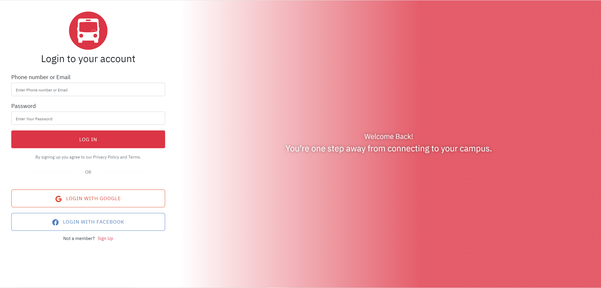

<h3> Mobile </h3>

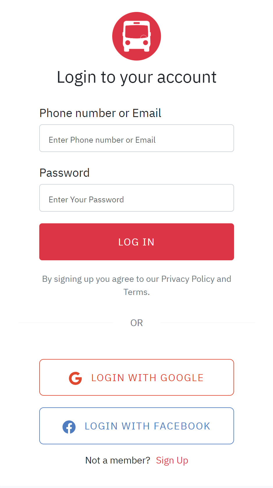

## Home Page:

<h3> Desktop: </h3>

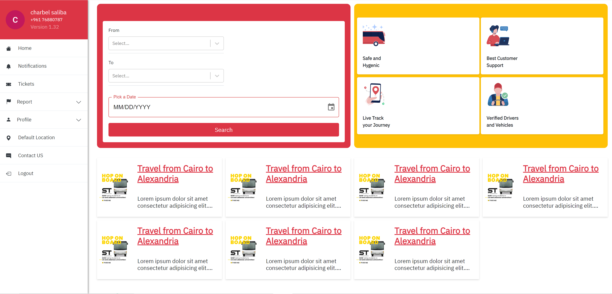

<h3> Mobile </h3>

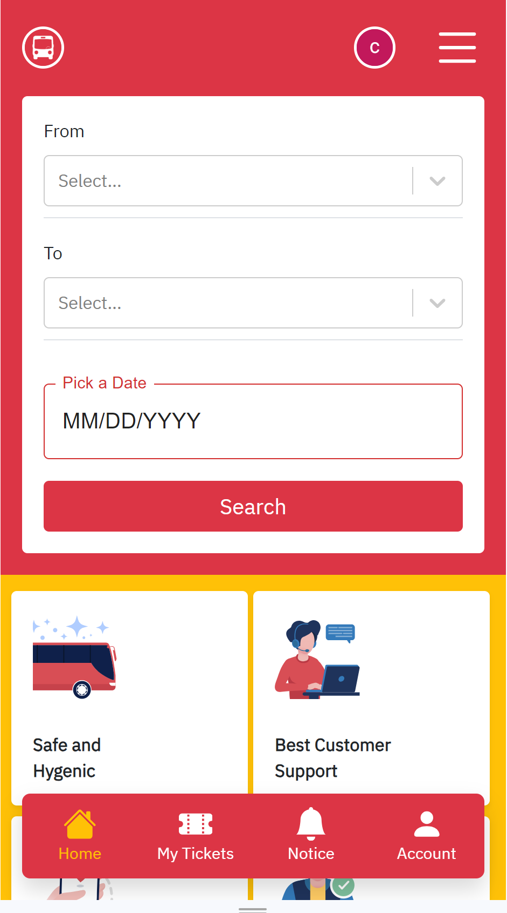

## Journeys Page:

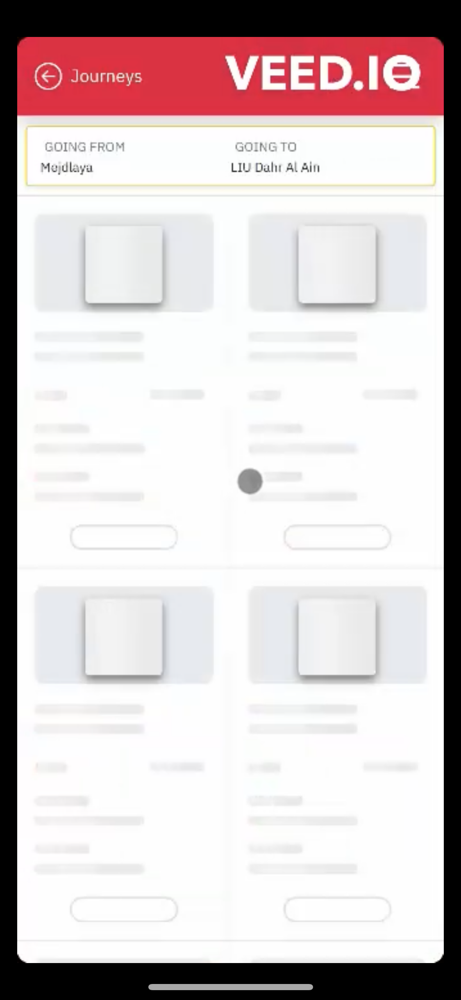
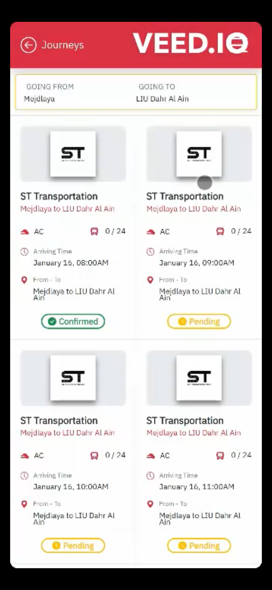

## Google Map:

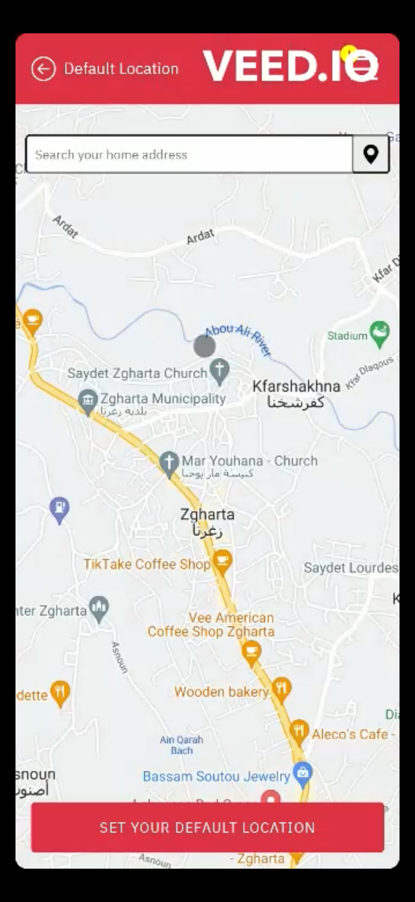
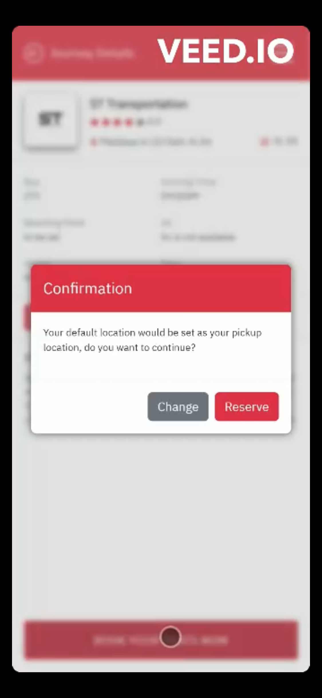

## Tickets Page:

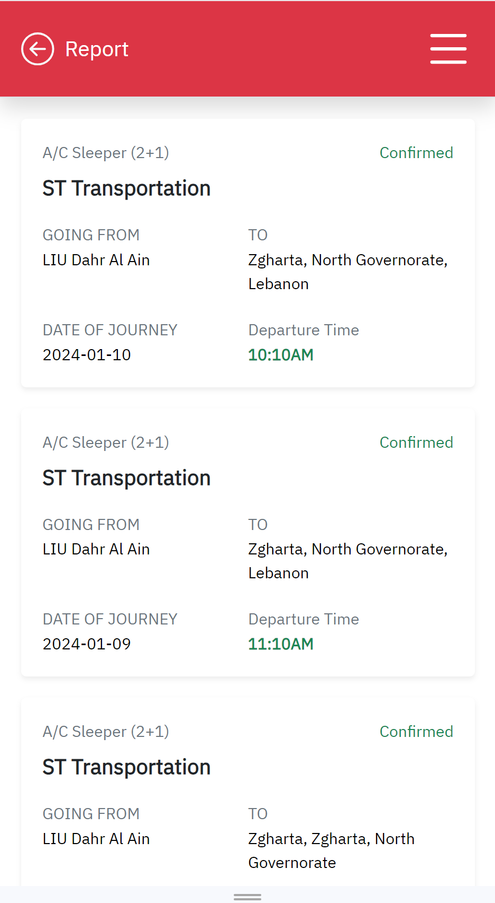
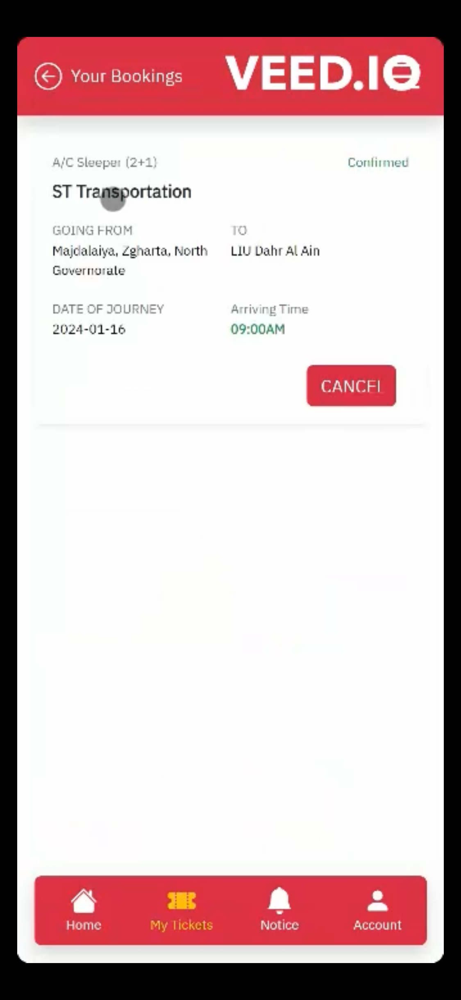
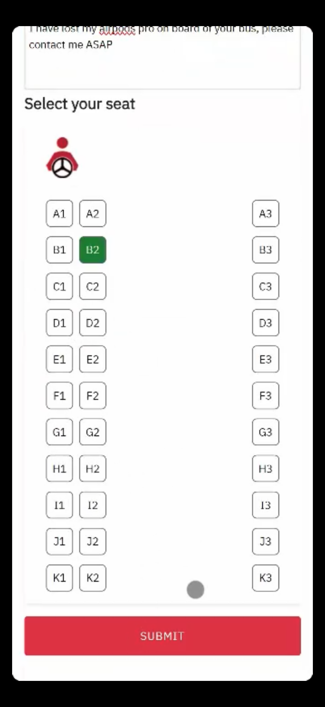

## Thanks ♥.
